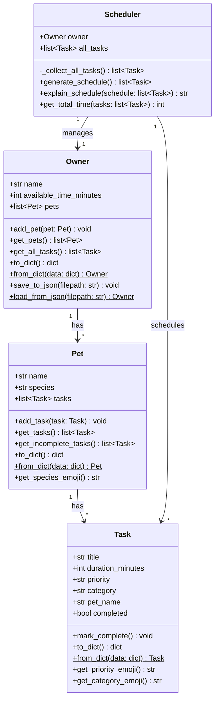

# PawPal+ UML Class Diagram

## Relationships

- **Owner has Pets**: One owner can have multiple pets (1 to many)
- **Pet has Tasks**: Each pet can have multiple care tasks (1 to many)
- **Scheduler manages Owner**: The scheduler works with one owner's data
- **Scheduler schedules Tasks**: The scheduler organizes all tasks into a daily plan

## New Features (Extensions)

### JSON Persistence
- `to_dict()` / `from_dict()` methods on Task, Pet, and Owner for serialization
- `save_to_json()` / `load_from_json()` on Owner for data persistence

### UI Enhancements
- `get_priority_emoji()` returns 🔴 (high), 🟡 (medium), 🟢 (low)
- `get_category_emoji()` returns 🚶 (walk), 🍽️ (feeding), 💊 (meds), ✂️ (grooming), 🎾 (enrichment)
- `get_species_emoji()` returns 🐕 (dog), 🐱 (cat), 🐾 (other)
